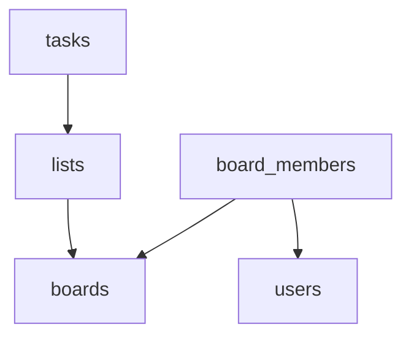

<h1 align="center" id="title">Backend for kanban board</h1>

<p align="center"></p>

<p id="description">REST API service for kanban board.</p>

Scheme of database:



<h2>🛠️ Installation Steps:</h2>

<p>1. Go 1.23</p>

<p>2. Prepare environment</p>

```
docker compose up -d
```

<p>3. Create and edit .env file</p>

```
cp .env.example .env
```

<p>4. Launch service</p>

```
go run cmd/service/main.go
```
